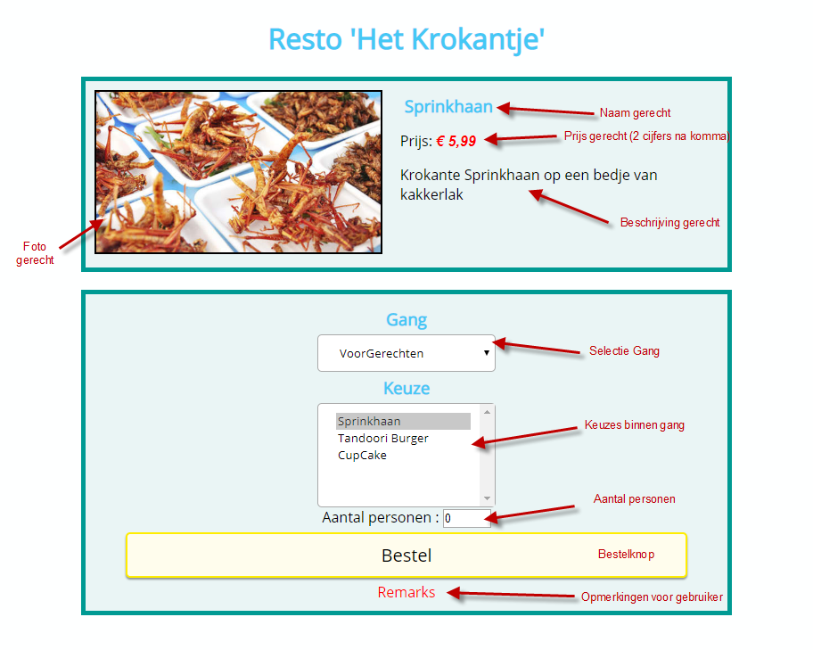
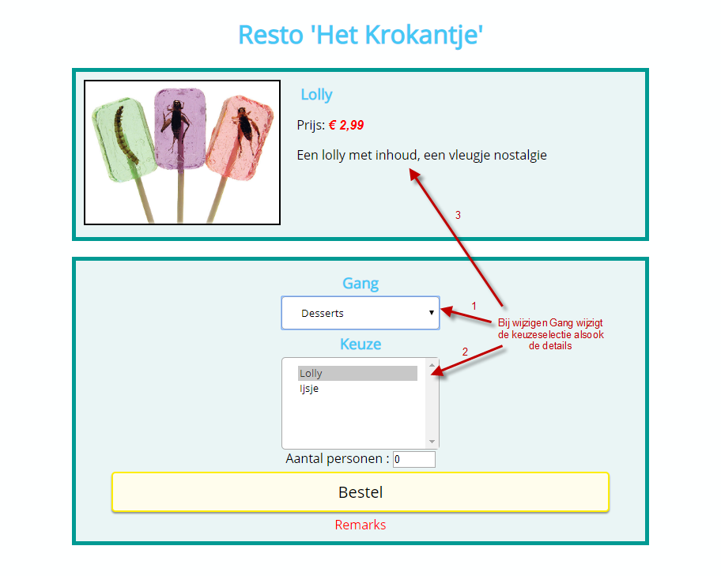
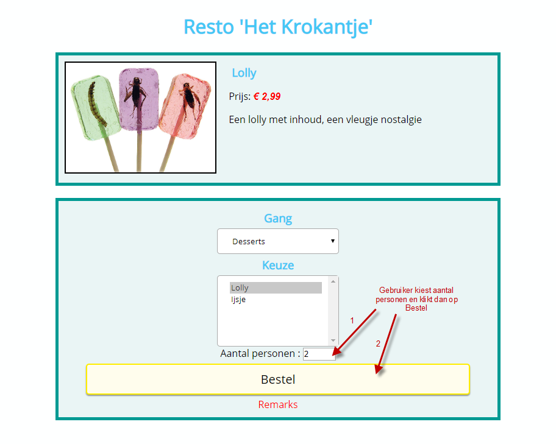
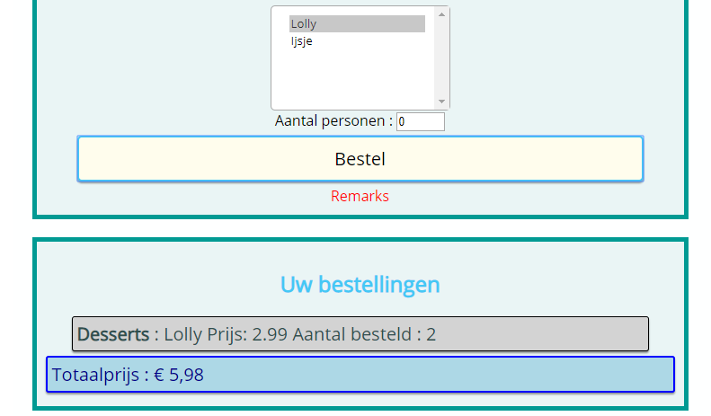

# pe-formulieren-json-krokantje-opl
Oefening met Objecten en FormulierElementen

# Krokantje
Maak een website voor het selecteren en bestellen van gerechten in een restaurant (naar keuze). Indien je geen inspiratie hebt kun je gebruik maken van de voorbereide file.  Gebruik JSON om de content van de website te vullen.

# Functionaliteiten
1. Bij het opstarten van de website wordt het eerste gerecht en zijn beschrijving getoond. In de selectievakjes kan de gebruiker een gang en een keuze maken.(Zie Startscherm)
2. Bij wijzigen van de gang worden de keuzes (zie Wijzigen Gang-Keuze) die bij de gang horen getoond en wordt standaard de eerste keuze geselecteerd.
3. De gebruiker krijgt de mogelijkheid te bestellen en geeft hiervoor het aantal personen in waarna hij/zij op de knop Bestel klikt. 
4. Bij **geldige** ingave (Zie Bestellen) wordt de bestelling onderaan het scherm weergegeven. (Zie Resultaat na eerste bestelling)
De gebruiker heeft de mogelijkheid om deze bestelling nog te annuleren, bij selectie van het gerecht en aantal personen = 0. Na aanklikken van de Bestel-knop wordt de bestellijn verwijdert.
5. Helemaal onderaan wordt de totaalprijs van de bestelling weergegeven. Deze wordt uiteraard aangepast aan de bestellingen die werden gemaakt en de wijzigingen die de gebruiker uitvoert.

# Enkele sfeerbeelden
## Startscherm

## Wijzigen Gang-Keuze

## Bestellen

## Resultaat eerste bestelling
